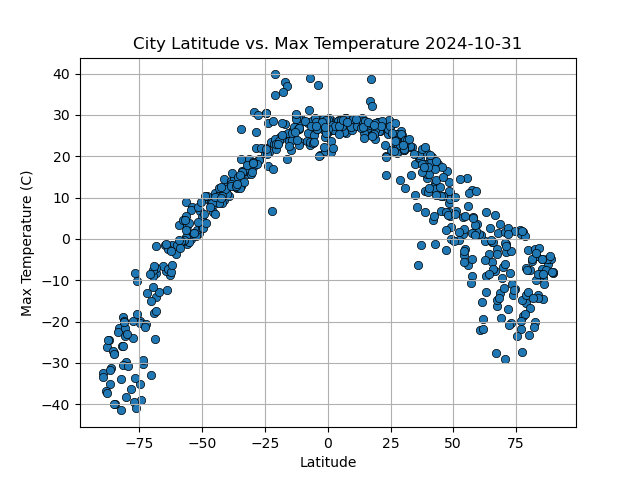

# python-api-challenge

## Introduction
Using an API call, weather data for several cities was retrieved. Then, regression was performed on scatter plots of several weather variables versus latitude.
Further, a geolocation API was used to retrieve places of interest near a subset of cities.

## Method
For generating a list of latitudes and longitudes and for identifying the cities closest to those coordinate pairs, the supplied code was used.

For the OpenWeatherMap API, the 5 day weather forecast API was chosen, since it provided both a maximum temperature and the country code. Instead of requesting all 40 possible forecasts within the 5 day period used for each API request, the query parameter cnt was changed to request just 1 for brevity.

Because weather trends tend to mirror across the equator, city weather data was split between Northern and Southern hemisphere subsets, then plotted and regressed separately.

For the Geoapify API, query parameters were included in the request URL using the params parameter of the requests.get() method.

## Findings
There was an obvious correlation between maximum temperature on the forecast date and latitude:

However, other metereological variables were less correlated with latitude, such as cloud cover in the Southern Hemisphere:

